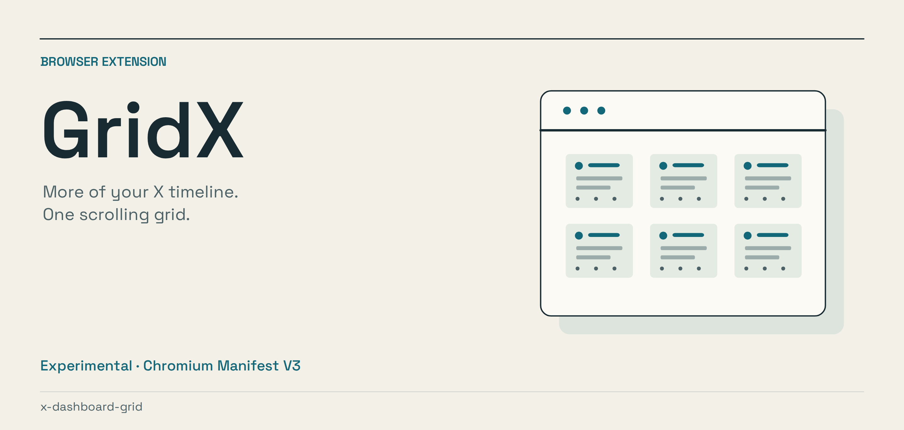
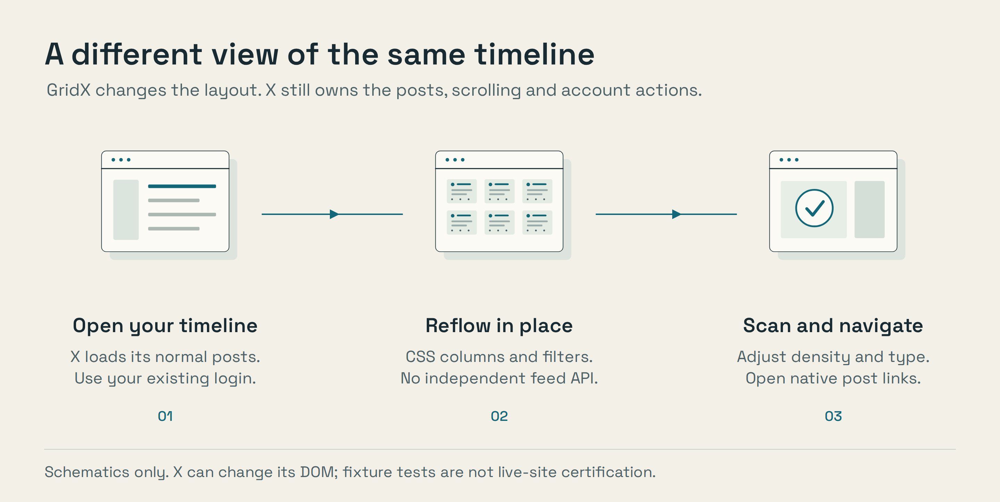

# GridX

GridX turns your existing X timeline into a denser, adjustable grid. It changes
X's own container in place rather than fetching separate feeds. Use it when
you want to scan more posts without opening several tabs.

**Experimental Chromium extension.** There is no build step or runtime package
dependency. X can change its markup, so compatibility needs maintenance.

*Architecture illustration, not a capture of a live X session. Editable
[artwork and rendering instructions](scripts/artwork/README.md) are included.*

## What it does, and what it does not

- Reflows already loaded posts into 1–8 columns with adjustable density and type.
- Keeps X responsible for its timeline, pagination, rendering and native clicks.
- Stores extension preferences locally with `chrome.storage.local`.
- Does not automate likes, reposts, follows or scrolling, and does not use an X API client.
- Does not provide independent feeds per column or guarantee freedom from platform restrictions.

Version 0.2 replaced the earlier node-hoisting approach with in-place layout.
The rationale is in [RESEARCH.md](RESEARCH.md). The local Playwright fixture
checks layout and controls; it is not a live-site or account-safety test.

## Features

*   **1–8 adjustable columns** (default 3), full-bleed feed, one scrolling grid.
*   **Density modes** — `compact` (max info), `cozy`, `roomy`, tighten gutters
    and tweet text scale.
*   **Scan mode** (`s`) — jumps to 8 columns × compact × hides avatars/media/
    metrics at 0.9× font = maximum information transfer.
*   **Font scale** 0.8×–1.4× applied to the feed.
*   **Click a post → opens the real post in a new tab** (native X permalink).
    Links, buttons and media controls keep working normally.
*   **Filters:** typeahead keyword bar (Enter applies, Esc clears). Terms hide
    matching posts; `-term` keeps only posts containing that term; handle
    include/exclude via stored settings.
*   **Vim-flavored keyboard nav** (list below).
*   **Stats:** rendered posts, hidden count, active time, column count — in the
    popup and a small status bar on the grid.
*   **Presets:** column presets and filter presets from Options.
*   **Extra CSS** hook for power users.

## Install (Chrome)

1.  Save / unpack this folder anywhere.
2.  Open `chrome://extensions`.
3.  Toggle **Developer mode** (top-right).
4.  Click **Load unpacked** and select the folder **containing `manifest.json`**
    (not the `src/` subfolder).
5.  Visit `https://x.com` (or `twitter.com`) while logged in.

> For an installable `.crx`/store build, zip the folder contents and upload to
> the Chrome Web Store.

## Keyboard map

| Key | Action |
|---|---|
| `j` / `k` · `↓` / `↑` | next / previous post |
| `g` / `G` | top / bottom |
| `d` / `u` | half page down / up |
| `Space` / `Shift+Space` | page down / up |
| `Enter` | open post in a **new tab** |
| `o` | open post in the **same tab** |
| `Backspace` | go back |
| `f` | focus filter bar |
| `s` | toggle scan mode |
| `p` | pause / resume grid |
| `?` | show / hide keymap overlay |
| `Esc` | close overlay / clear cursor |
| **Click a post** | open the real post in a **new tab** |

Browser-level (MV3 `commands`):

| Shortcut | Action |
|---|---|
| `Ctrl+Shift+G` / `Cmd+Shift+G` | toggle GridX grid on/off |
| `Ctrl+Shift+P` / `Cmd+Shift+P` | pause / resume grid |

Keys are ignored while you're typing in a text field.

## Popup

Use the toolbar icon for a compact panel: column slider (live), density
segmented control, toggles (Media, Metrics, Avatars, Filter promoted, Filter
reposts, Filter verified), a quick keyword filter box, **Scan mode** and
**Pause** buttons, live stats, and a link to Options. Every control writes
settings and pushes them to the active tab instantly.

## Options

Full-page editor (also reachable via popup → Options):

*   **Layout:** columns, density, font scale, bleed mode.
*   **Content:** show/hide media, metrics, avatars; filter promoted/reposts/verified.
*   **Column presets & filter presets:** save the current settings under a name,
    load/delete. Column presets capture columns/density/font/bleed; filter
    presets capture keyword+handle filters.
*   **Keyboard map:** read-only reference (v0.x).
*   **Extra CSS:** textarea appended to the grid's styles at runtime (**Apply**),
    plus **Reset to defaults**.

## Troubleshooting

*   **"GridX: timeline not found"** — GridX couldn't detect the container whose
    children are the tweets. Usually means (a) you're not on a timeline page, or
    (b) X shipped markup changes. Reload the page; if it persists, the layered
    selector logic in `src/content/content.js` (`isStreamHost`/`findHost`) may
    need updating. Disable the extension if X behaves unexpectedly; DOM changes can break compatibility.
*   **Grid shows one column** — the stream container or X's layout isn't being
    re-flowed (X markup drift). Columns are set inline on the detected
    `[data-gx-stream]` container.
*   **Previously rate-limited in v0.1** — that was the *hoisting* behavior
    emptying the timeline and over-triggering X's sentinel. v0.2 keeps articles
    in place, so pagination follows your real scroll cadence. If you got a
    temporary block, it clears on its own; GridX itself never bulk-fetches.
*   **Icons/layout overlap in v0.1** — also fixed by v0.2: we no longer override
    X's per-article internals.
*   **How to completely reset** — Options → **Reset to defaults** (clears
    settings, keeps presets). To clear everything, remove the extension.

## Developer notes

*   **No build step, no bundler, no dependencies.** Vanilla JS (ES2022). All
    scripts pass `node --check`; `manifest.json` validates with
    `python3 -m json.tool`.
*   **Local test hook:** `content_scripts.matches` includes `http://localhost/*`
    and `http://127.0.0.1/*` **only** so the Playwright smoke test can exercise
    the extension against `test/fixture.html` (not needed on x.com).
*   **Smoke test:** `cd <repo> && python3 test/smoke_test.py` needs Playwright +
    a Chrome-for-Testing binary (auto-found under Playwright's cache or
    `/tmp/pw-browsers`) and a display (headful is required for
    `--load-extension`). It starts its own HTTP server on `127.0.0.1:8765` and
    asserts all 7 checks:
    1. `#gridx-root` overlay exists
    2. stream host found + ≥20 articles present
    3. default 3 CSS columns on the host
    4. `load more` grows the grid (MutationObserver)
    5. `gridx:update {columnCount:4}` → 4 columns
    6. keyword filter hides matching posts
    7. `scanMode:true` → `gridx-scan` on `<html>`
*   **Icons:** the checked-in PNG files are under `icons/`.

## Risk summary

GridX is a layout extension, not an account-automation tool. Its settings do
write to local extension storage; "read-only" refers to the absence of automated
account actions, not the absence of all writes. Native X controls still perform
the actions you click.

Maintenance and platform-policy risks remain. In-place layout is not a promise
that X will never restrict an account. Read [RESEARCH.md](RESEARCH.md), use your
own account, and disable the extension if it causes unexpected behavior.

To help, report the affected page type, browser version, and steps to reproduce
a layout problem. Redact private messages, account identifiers and tokens.

## License

MIT. Reference / educational build produced from `BUILD_BRIEF.md`. Not
affiliated with or endorsed by X Corp.